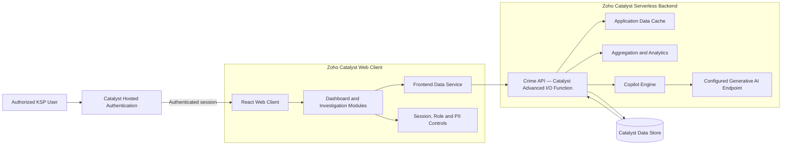

# MADHUKAR — KSP Crime Analytics Dashboard

**Modern Analytics and Data Hub for User-Friendly Karnataka Anti-Crime Response**

MADHUKAR is a secure, data-driven crime analytics and operational intelligence dashboard developed for the **Karnataka State Police (KSP) Datathon**, organized using **Zoho Catalyst**. It brings statewide crime data, geospatial intelligence, investigation workflows, predictive indicators, reports, and AI-assisted analysis into a single command interface.

## Live Deployment

| Environment | URL |
| --- | --- |
| Zoho Catalyst Development | [Open MADHUKAR Dashboard](https://ksp-crime-analytics-60076926826.development.catalystserverless.in/app/) |
| Catalyst Hosted Login | [Open secure login](https://ksp-crime-analytics-60076926826.development.catalystserverless.in/__catalyst/auth/login) |

> The public link opens the Catalyst authentication flow. Access requires a user registered or permitted through the project's Catalyst Authentication configuration.

## Problem Statement

Crime information is often distributed across case records, geographic datasets, evidence systems, station-level reports, and historical statistics. This fragmentation slows situational awareness and makes correlations difficult to identify.

MADHUKAR provides a unified operational view that helps authorized police personnel:

- Monitor statewide and district-level crime indicators.
- Identify geographic concentrations and emerging patterns.
- Inspect serious FIRs and case status information.
- Correlate suspects, cases, evidence, and timelines.
- Generate statistical and operational reports.
- Review predictive risk indicators and AI-assisted insights.
- Move from high-level alerts to case-level investigation workflows.

## Key Capabilities

- **Command dashboard:** Operational KPIs, alerts, crime distribution, trends, district performance, and serious FIR summaries.
- **GIS intelligence:** Karnataka district choropleth, crime markers, heat layers, filters, timelines, and district drill-down.
- **Statistical analytics:** Temporal patterns, category distributions, spatial comparisons, performance rankings, and AI insights.
- **Case investigation:** Case overview, evidence workspace, suspect timeline, and evidence correlation.
- **Criminal network analysis:** Relationship graph for connected suspects, cases, and entities.
- **Predictive intelligence:** Regional risk scores, forecasts, anomalies, and priority indicators.
- **Operational briefing:** Executive summaries, trend comparisons, recommendations, alerts, and situational maps.
- **AI Copilot:** Natural-language assistance backed by the serverless crime API and configured model integration.
- **Reports and exports:** PDF/image-based report generation and downloadable operational summaries.
- **Administration:** User-management views, access indicators, security settings, and audit information.
- **Accessibility:** Theme controls, high contrast, color-safe presentation, scalable text, keyboard support, and responsive layouts.

## System Architecture



### Request Flow

1. A user opens the hosted `/app/` endpoint.
2. The client checks for a valid browser session and Catalyst authentication.
3. Unauthenticated users are redirected to Catalyst Hosted Login.
4. After successful authentication, Catalyst returns the user to `/app/index.html`.
5. The client validates the Catalyst user and opens the canonical `/app/` dashboard.
6. Dashboard modules request operational data from `/server/crime_api/api/*`.
7. The Catalyst function queries Data Store, applies joins/aggregations, and returns normalized JSON.
8. React renders maps, charts, tables, investigation workspaces, and reports.

## Technology Stack

| Layer | Technology |
| --- | --- |
| Frontend | React 19, React Router |
| Charts | Recharts |
| Maps | Leaflet, React Leaflet, Turf, heat and marker-cluster plugins |
| Icons | React Icons |
| Reports | jsPDF, jsPDF AutoTable, html2canvas |
| Backend | Node.js, Express, Zoho Catalyst Advanced I/O Function |
| Database | Zoho Catalyst Data Store and ZCQL |
| Authentication | Zoho Catalyst Hosted Authentication and Web SDK |
| Hosting | Zoho Catalyst Web Client Hosting |
| AI integration | Server-side Copilot engine and configured Zoho model endpoint |

## Security and Session Controls

- The deployed React application validates the current user through the Catalyst Web SDK before rendering protected content.
- Direct access to `/app/` without a current browser session redirects to Catalyst Hosted Login.
- A browser-scoped marker is stored in `sessionStorage`; it expires when the browser session closes.
- An inactivity timer logs the user out after **2 minutes 30 seconds** without mouse, pointer, keyboard, scroll, click, or touch activity.
- Manual logout and automatic timeout clear the local browser-session marker, end the Catalyst session, and return the user to the hosted login page.
- PII access has a separate restricted/command-mode workflow and local audit trail.
- Sensitive model credentials belong in Catalyst function environment variables and must never be committed to Git.

> The client-side role and PII indicators support the demonstration workflow. Production authorization must also be enforced on every protected backend API and Data Store operation using Catalyst Security Rules and server-side role checks.

## Project Structure

```text
.
├── catalyst.json                         # Catalyst project resource configuration
├── crime-analytics-dashboard/            # React web client
│   ├── client-package.json               # Hosted client/login redirect configuration
│   ├── public/                            # Static assets and KSP emblem
│   └── src/
│       ├── components/                    # Header, sidebar, filters and shared UI
│       ├── context/                       # Security and date-filter contexts
│       ├── data/                          # Schema adapters and sample data
│       ├── features/                      # Feature-specific charts, maps and logic
│       ├── pages/                         # Routed application pages
│       ├── security/                      # Redaction and security utilities
│       ├── services/                      # Catalyst/sample data service
│       ├── App.js                         # Application shell and routes
│       └── index.js                       # Authentication gate and React entry point
├── functions/
│   ├── crime_api/                         # Primary Catalyst Advanced I/O API
│   │   ├── index.js                       # Express endpoints
│   │   ├── dataCache.js                   # Server-side data cache
│   │   ├── copilotEngine.js               # Copilot orchestration
│   │   └── glmClient.js                   # Model endpoint client
│   └── ksp_crime_analytics_function/      # Additional Catalyst function resource
└── docs/                                  # Integration and technical notes
```

## Backend API

The client communicates with the Catalyst function through:

```text
/server/crime_api/api
```

Major routes include:

| Method | Route | Purpose |
| --- | --- | --- |
| `GET` | `/api/app-data` | Retrieve the cached, normalized application dataset |
| `GET` | `/api/dashboard` | Dashboard KPIs and chart-ready aggregates |
| `GET` | `/api/cases` | Filtered and joined case records |
| `GET` | `/api/statistics` | Statistical aggregates |
| `GET` | `/api/predictions` | Risk scores, forecasts, and anomalies |
| `GET` | `/api/reports` | Report metrics and summaries |
| `GET` | `/api/lookup` | Quick FIR/case lookup |
| `GET` | `/api/masters` | Master and reference data |
| `GET` | `/api/districts` | District lookup data |
| `GET` | `/api/crimeheads` | Crime taxonomy data |
| `GET` | `/api/stations` | Police-station lookup data |
| `GET` | `/api/employees` | Officer lookup data |
| `POST` | `/api/copilot/chat` | AI Copilot requests |
| `POST` | `/api/cache/invalidate` | Invalidate the server-side application cache |

The local reset route is disabled unless its explicit development-only environment flag and confirmation header are present.

## Prerequisites

- Node.js 18 or later
- npm
- Zoho Catalyst CLI
- Access to the correct Catalyst project and Development environment
- Catalyst Authentication and required Data Store tables configured

Install the Catalyst CLI if it is not already installed:

```bash
npm install -g zcatalyst-cli
```

Authenticate the CLI:

```bash
catalyst login
```

## Local Development

### UI with bundled sample data

Use this mode when Catalyst services are not running.

PowerShell:

```powershell
cd crime-analytics-dashboard
npm install
$env:REACT_APP_DATA_SOURCE = "sample"
npm start
```

macOS/Linux:

```bash
cd crime-analytics-dashboard
npm install
REACT_APP_DATA_SOURCE=sample npm start
```

Open `http://localhost:3000`.

### Full Catalyst development environment

Install dependencies for the client and function:

```bash
cd crime-analytics-dashboard
npm install
cd ../functions/crime_api
npm install
cd ../..
```

From the repository root, start the Catalyst development server:

```bash
catalyst serve
```

The exact local URLs are printed by the Catalyst CLI. Hosted authentication behavior must be verified on the deployed Catalyst domain.

## Environment Variables

The application can use the following optional variables. Configure secrets in Catalyst Function Environment Variables, not in committed `.env` files.

| Variable | Scope | Description |
| --- | --- | --- |
| `REACT_APP_DATA_SOURCE=sample` | Client | Use bundled sample data for standalone UI development |
| `REACT_APP_GRAFANA_BASE_URL` | Client | Optional Grafana integration URL |
| `REACT_APP_GRAFANA_API_KEY` | Client | Optional client-side Grafana key; avoid this pattern for production secrets |
| `ZOHO_ACCOUNTS_URL` | Function | Zoho accounts domain; defaults to the India domain |
| `ZOHO_CLIENT_ID` | Function | OAuth client identifier |
| `ZOHO_CLIENT_SECRET` | Function | OAuth client secret |
| `ZOHO_REFRESH_TOKEN` | Function | OAuth refresh token |
| `ZOHO_ACCESS_TOKEN` | Function | Optional temporary server-side access token |
| `ENABLE_LOCAL_DATA_RESET` | Function | Explicitly enables the protected local reset route |

## Build and Verification

Build the production client:

```bash
cd crime-analytics-dashboard
npm run build
```

Run tests in non-interactive mode:

```bash
npm test -- --watchAll=false
```

## Deploy to Zoho Catalyst

Run deployment commands from the repository root—the directory containing `catalyst.json`.

Deploy only the React client:

```bash
catalyst deploy --only client
```

Deploy only the primary function:

```bash
catalyst deploy --only functions:crime_api
```

Deploy all configured resources:

```bash
catalyst deploy
```

After client deployment, verify the application in a fresh private/incognito browser window:

1. Open the [deployed dashboard](https://ksp-crime-analytics-60076926826.development.catalystserverless.in/app/).
2. Confirm redirection to Catalyst Hosted Login.
3. Sign in and confirm redirection to the dashboard.
4. Verify that the live IST clock updates.
5. Verify that user activity resets the `02:30` idle timer.
6. Allow the timer to expire and confirm logout redirection.
7. Sign in again, use the sidebar Logout button, and confirm session termination.
8. Close the browser, reopen it, and confirm that a new login is required.

## Demonstration Story

A concise hackathon demonstration can follow this sequence:

```text
Secure login
→ Statewide command overview
→ Identify a high-risk district or alert
→ Explore the GIS and statistical pattern
→ Open the related case and evidence workspace
→ Inspect suspect/evidence relationships
→ Review predictive or Copilot recommendations
→ Generate an operational report
```

## Data and Responsible Use

- Predictions are decision-support indicators, not determinations of guilt or certainty.
- Operational actions must be reviewed and authorized by qualified KSP personnel.
- Personally identifiable and sensitive law-enforcement data must follow applicable access-control, retention, audit, and legal requirements.
- Sample or synthetic data should be used in public demonstrations unless explicit authorization exists for real records.
- Do not commit credentials, production datasets, access tokens, exported reports, or PII to the repository.

## Troubleshooting

### The deployed dashboard does not contain the latest UI changes

Run the client deployment from the repository root and hard-refresh the browser:

```bash
catalyst deploy --only client
```

### The application repeatedly returns to login

- Confirm `login_redirect` is `index.html` in `crime-analytics-dashboard/client-package.json`.
- Confirm the latest client build has been deployed.
- Clear site data or use a fresh private/incognito window.
- Confirm the user is active in Catalyst Authentication.

### The standalone React server reports Catalyst API errors

Run the client with `REACT_APP_DATA_SOURCE=sample`, or start the full project through `catalyst serve`.

### The Copilot cannot authenticate with the model endpoint

Verify the server-side OAuth environment variables in Catalyst. Never place these credentials in frontend code.

## Hackathon Context

This project was created for the **Karnataka State Police Datathon / Hackathon** using the **Zoho Catalyst** serverless platform.

## License and Access

No open-source license is currently declared. Unless a license is added, the source remains under its contributors' default copyright. Operational KSP data and project access remain subject to the policies and authorization of the relevant organizations.

