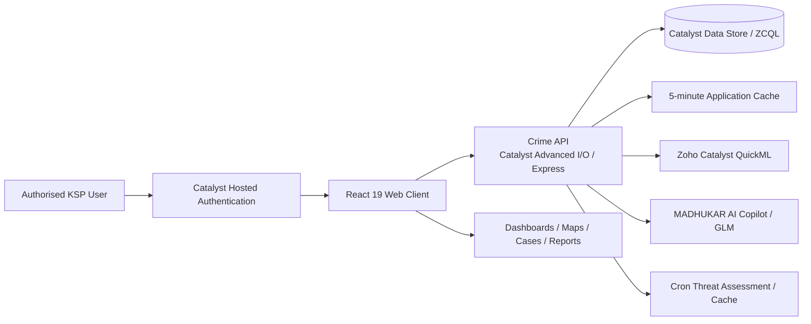

The more with an PPT will open on the performance.# MADHUKAR - KSP Crime Intelligence Platform

**Modern Analytics and Data Hub for User-Friendly Karnataka Anti-Crime Response**

MADHUKAR is an AI-enabled crime intelligence and investigation prototype developed for the Karnataka State Police Datathon. It brings FIR, case, suspect, evidence, geographic, district, and police-station records into one command environment, helping authorised users move from statewide intelligence to case-level investigation.

> This project uses approved/demo data only. It is a decision-support prototype and must not be used to determine guilt or initiate action without authorised human review.

## Live Prototype

| Service | Link |
| --- | --- |
| Dashboard | [Open MADHUKAR](https://ksp-crime-analytics-60076926826.development.catalystserverless.in/app/) |
| Secure login | [Catalyst Hosted Login](https://ksp-crime-analytics-60076926826.development.catalystserverless.in/__catalyst/auth/login) |

The hosted prototype is intended for authorised hackathon evaluators. Do not publish demo credentials, TOTP setup keys, secrets, or real police data.

## Problem Statement

Crime information can be distributed across FIRs, station records, case files, evidence records, geographic systems, and historical datasets. This fragmentation can delay situational awareness, obscure relationships between cases, and make proactive identification of crime hotspots difficult.

MADHUKAR provides a unified operational interface for monitoring trends, analysing geography, investigating linked records, generating reports, and reviewing AI-assisted intelligence.

## Core Capabilities

- **Command dashboard:** Statewide and district-level KPIs, crime trends, category analysis, serious-case monitoring, alerts, and operational summaries.
- **GIS intelligence:** Interactive district maps, crime markers, heatmaps, hotspot analysis, filters, and drill-down.
- **Investigation workspace:** Connected views of cases, suspects, victims, evidence, timelines, and criminal-network relationships.
- **Predictive intelligence:** Risk indicators, forecasts, anomalies, and priority signals. QuickML inference is used when configured.
- **MADHUKAR AI Copilot:** Natural-language queries over the application dataset using tool-assisted retrieval and analysis.
- **Reports and briefings:** Downloadable reports, operational briefings, summaries, recommendations, and visual analytics.
- **PII protection:** TOTP-based Authenticator-app verification for restricted-data unlock workflows.
- **Automation:** Scheduled threat-assessment and threat-alert endpoints for recurring review.

The prototype is backed by approximately **1,500 FIR records across 26 structured tables**.

## Architecture



### Request Flow

1. The user accesses the hosted React application and authenticates through Catalyst Hosted Authentication.
2. The React client calls `/server/crime_api/api/*`.
3. The Catalyst Advanced I/O Express API retrieves and normalises records from Catalyst Data Store through ZCQL.
4. Frequently requested application data is retained in a five-minute server-side in-process cache.
5. The client renders dashboards, maps, reports, case workspaces, prediction views, and Copilot responses.
6. Scheduled threat assessment evaluates relevant records and stores generated alerts in Catalyst Cache where available.

## Technology Stack

| Layer | Technology |
| --- | --- |
| Frontend | React 19, React Router, React Icons |
| Mapping and visualisation | Leaflet, React Leaflet, Leaflet Heat, Marker Cluster, Turf, Recharts |
| Reporting | jsPDF, jsPDF AutoTable, html2canvas |
| Backend | Node.js, Express, Zoho Catalyst Advanced I/O |
| Data | Zoho Catalyst Data Store, ZCQL, server-side application cache |
| AI and ML | MADHUKAR Copilot, configured GLM endpoint, Zoho Catalyst QuickML |
| Hosting and authentication | Zoho Catalyst Web Client Hosting, Catalyst Hosted Authentication |
| PII verification | `otpauth` TOTP validation with an Authenticator app |
| Notifications | Browser notifications and Catalyst Push when available |

## Security and Responsible Use

- Catalyst Hosted Authentication protects access to the deployed application.
- Restricted PII workflows require a six-digit TOTP from an enrolled Authenticator app.
- The client supports restricted/command session states and inactivity-based locking.
- The prototype includes audit-focused UI workflows.
- AI, risk predictions, alerts, and recommendations are decision-support outputs only.
- Qualified personnel must review and authorise every operational decision.

### Production Security Requirements

The prototype TOTP workflow is suitable for demonstration only. Before production use:

- Generate a unique TOTP secret for each officer.
- Store secrets only in encrypted server-side storage.
- Never expose a setup key in the frontend after enrolment.
- Enforce roles and permissions at the API/data layer, not only in the UI.
- Move audit records from browser storage to an immutable server-side audit service.
- Use approved production identity, retention, encryption, and evidence-management controls.

## Repository Structure

```text
.
├── catalyst.json
├── README.md
├── crime-analytics-dashboard/       # React web client
│   ├── public/                      # Static assets and service worker
│   ├── src/
│   │   ├── components/              # Shared UI components
│   │   ├── context/                 # Security and date-filter contexts
│   │   ├── data/                    # Sample data and schema selectors
│   │   ├── features/                # Dashboard, map, briefing, statistics modules
│   │   ├── pages/                   # Application pages
│   │   ├── services/                # API data service
│   │   └── utils/                   # Exports, filters, alerts
│   ├── client-package.json
│   └── package.json
├── functions/
│   ├── crime_api/                   # Primary Catalyst Advanced I/O API
│   │   ├── index.js                 # API routes
│   │   ├── dataCache.js             # Data Store retrieval and caching
│   │   ├── copilotEngine.js         # Copilot orchestration and QuickML calls
│   │   ├── glmClient.js             # Configured GLM client
│   │   └── package.json
│   └── ksp_crime_analytics_function/
└── docs/
```

## Prerequisites

- Node.js 18 or later
- npm
- Zoho Catalyst CLI
- Access to the intended Catalyst project and development environment
- Catalyst Authentication enabled
- Required Catalyst Data Store tables configured

Install and authenticate the Catalyst CLI:

```bash
npm install -g zcatalyst-cli
catalyst login
```

## Local Setup

Clone the repository and install dependencies:

```bash
git clone <repository-url>
cd Crime_Analytics_Dashboard-main

cd crime-analytics-dashboard
npm install

cd ../functions/crime_api
npm install

cd ../..
```

### Run the UI with Sample Data

Use this mode to review the UI without Catalyst services.

**PowerShell**

```powershell
cd crime-analytics-dashboard
$env:REACT_APP_DATA_SOURCE = "sample"
npm start
```

**macOS/Linux**

```bash
cd crime-analytics-dashboard
REACT_APP_DATA_SOURCE=sample npm start
```

Open `http://localhost:3000`.

### Run with Catalyst Services

From the project root:

```bash
catalyst serve
```

The Catalyst CLI provides local client and function URLs. Hosted Authentication should be tested on the deployed Catalyst domain.

### Production Build

```bash
cd crime-analytics-dashboard
npm run build
```

### Frontend Tests

```bash
cd crime-analytics-dashboard
npm test -- --watchAll=false
```

## Configuration

Never commit production secrets, real PII, tokens, or live credentials.

| Variable | Scope | Purpose |
| --- | --- | --- |
| `REACT_APP_DATA_SOURCE=sample` | Client | Uses bundled sample data for standalone UI mode |
| `REACT_APP_GRAFANA_BASE_URL` | Client | Optional Grafana integration URL |
| `REACT_APP_GRAFANA_API_KEY` | Client | Optional Grafana key; avoid exposing client-side secrets |
| `ZOHO_ACCOUNTS_URL` | Function | Zoho accounts domain |
| `ZOHO_CLIENT_ID` | Function | Model-service OAuth client ID |
| `ZOHO_CLIENT_SECRET` | Function | Model-service OAuth client secret |
| `ZOHO_REFRESH_TOKEN` | Function | Model-service OAuth refresh token |
| `ZOHO_ACCESS_TOKEN` | Function | Optional temporary server-side access token |
| `CRON_SECRET_KEY` | Function | Protects scheduled threat-assessment requests |
| `ENABLE_LOCAL_DATA_RESET` | Function | Enables the local-development reset route only |

## API Overview

Base path: `/server/crime_api/api`

| Method | Endpoint | Purpose |
| --- | --- | --- |
| `GET` | `/dashboard` | Dashboard KPIs and aggregates |
| `GET` | `/cases` | Filtered case records |
| `GET` | `/statistics` | Statistical analysis |
| `GET` | `/predictions` | Risk scores, forecasts, and hotspots |
| `GET` | `/reports` | Report metrics and summaries |
| `GET` | `/app-data` | Cached, normalised application dataset |
| `GET` | `/lookup` | FIR and case lookup |
| `GET` | `/masters`, `/districts`, `/crimeheads`, `/stations`, `/employees` | Reference data |
| `POST` | `/copilot/chat` | MADHUKAR AI Copilot query |
| `POST` | `/security/request-otp` | Legacy email OTP request endpoint |
| `POST` | `/security/verify-otp` | Legacy email OTP verification endpoint |
| `POST` | `/cache/invalidate` | Invalidates server-side application cache |
| `POST` | `/cron/threat-assess` | Runs the scheduled threat assessment |
| `GET` | `/cron/threat-alerts` | Retrieves generated threat alerts |

> The current PII unlock interface uses TOTP validation in the client. The email OTP API endpoints remain available in the backend but should be consolidated or removed before production.

## Deployment

Run from the repository root:

```bash
# Deploy the React client
catalyst deploy --only client

# Deploy the API function
catalyst deploy --only functions:crime_api

# Deploy all configured Catalyst resources
catalyst deploy
```

After deployment, verify authentication, dashboard loading, GIS views, case workspaces, reports, Copilot behaviour, TOTP access control, notifications, logout, and session locking.

## License

No open-source licence is currently declared. Unless a licence is added, the source remains under the contributors' default copyright.
