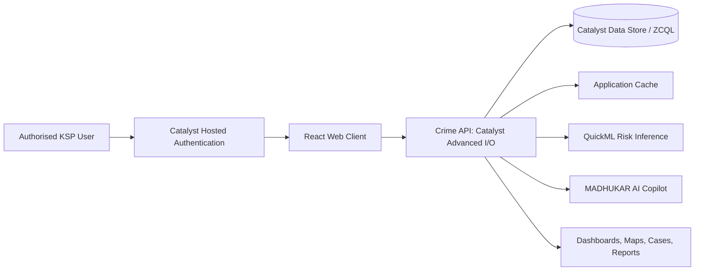

# MADHUKAR - KSP Crime Intelligence Platform

**Modern Analytics and Data Hub for User-Friendly Karnataka Anti-Crime Response**

MADHUKAR is an AI-enabled crime intelligence and investigation platform developed for the Karnataka State Police Datathon. It brings FIR, case, suspect, evidence, geographic, and police-station data into one secure operational environment, enabling authorised users to move from statewide intelligence to case-level investigation.

## Live Prototype

| Service | Link |
| --- | --- |
| Dashboard | [Open MADHUKAR](https://ksp-crime-analytics-60076926826.development.catalystserverless.in/app/) |
| Secure login | [Catalyst Hosted Login](https://ksp-crime-analytics-60076926826.development.catalystserverless.in/__catalyst/auth/login) |

> The hosted prototype is intended for hackathon demonstration accounts only. It uses demo data; credentials should be shared only with authorised evaluators.

## Problem Statement

Crime information is typically distributed across FIRs, station reports, case files, geographic systems, evidence stores, and historical records. This fragmentation delays situational awareness and makes it difficult to discover hotspots, case relationships, and emerging risks.

MADHUKAR provides a unified command environment that supports authorised officers in monitoring crime, analysing geography and trends, investigating linked entities, producing briefings, and reviewing AI-assisted decision-support outputs.

## Core Capabilities

- **Command dashboard:** statewide and district KPIs, trends, category breakdowns, serious cases, alerts, and performance views.
- **GIS intelligence:** district maps, crime markers, heatmaps, hotspot analysis, filters, and drill-down.
- **Investigation workspace:** linked cases, suspects, evidence, timelines, and criminal-network relationships.
- **Predictive intelligence:** district risk scores, forecasts, anomalies, and priority indicators. QuickML risk inference is used when configured.
- **MADHUKAR AI Copilot:** natural-language queries over the application dataset, with tool-assisted searches, analyses, and risk requests.
- **Reports and briefing:** downloadable operational reports, situational summaries, alerts, and recommendations.
- **Security controls:** Catalyst hosted authentication, role-oriented UI access, OTP-based PII verification, session controls, and audit-focused workflows.
- **Automation:** scheduled threat assessment and threat-alert endpoints for recurring risk evaluation.

The deployed prototype is backed by **1,501 FIR records across 26 structured tables**.

## Architecture



### Request flow

1. The user opens the hosted `/app/` client and authenticates through Catalyst.
2. React renders the command dashboard and calls `/server/crime_api/api/*`.
3. The serverless API validates and normalises Data Store results, joins records, and caches application data.
4. The client renders KPIs, maps, charts, case workspaces, reports, and Copilot responses.

## Technology Stack

| Layer | Technology |
| --- | --- |
| Frontend | React 19, React Router, React Icons |
| Visualisation | Recharts, Leaflet, React Leaflet, Turf, heat and marker-cluster plugins |
| Reporting | jsPDF, jsPDF AutoTable, html2canvas |
| Backend | Node.js, Express, Zoho Catalyst Advanced I/O Function |
| Data | Zoho Catalyst Data Store, ZCQL, application cache |
| AI/ML | MADHUKAR Copilot, configured GLM endpoint, Zoho Catalyst QuickML |
| Security and hosting | Catalyst Hosted Authentication, Web SDK, Web Client Hosting |

## Repository Structure

```text
.
|-- catalyst.json                          # Catalyst resource configuration
|-- crime-analytics-dashboard/             # React web client
|   |-- public/                            # Static assets
|   |-- src/                               # Pages, features, components, services
|   |-- client-package.json                # Client-hosting configuration
|   `-- package.json
`-- functions/
    |-- crime_api/                         # Primary Advanced I/O API
    |   |-- index.js                       # API routes
    |   |-- dataCache.js                   # Cache and data access helpers
    |   |-- copilotEngine.js               # Copilot orchestration and QuickML calls
    |   `-- glmClient.js                   # Configured model endpoint client
    `-- ksp_crime_analytics_function/      # Additional function resource
```

## Prerequisites

- Node.js 18 or later
- npm
- Zoho Catalyst CLI
- Access to the intended Catalyst project and Development environment
- Catalyst Authentication and the required Data Store tables configured

Install and authenticate the Catalyst CLI:

```bash
npm install -g zcatalyst-cli
catalyst login
```

## Setup and Execution

### 1. Clone and install dependencies

```bash
git clone <repository-url>
cd Crime_Analytics_Dashboard-main
cd crime-analytics-dashboard
npm install
cd ../functions/crime_api
npm install
cd ../..
```

### 2. Run the UI locally with sample data

This mode is suitable for reviewing the interface without Catalyst services.

**PowerShell**

```powershell
cd crime-analytics-dashboard
$env:REACT_APP_DATA_SOURCE = "sample"
npm start
```

**macOS/Linux**

```bash
cd crime-analytics-dashboard
REACT_APP_DATA_SOURCE=sample npm start
```

Open [http://localhost:3000](http://localhost:3000).

### 3. Run the full Catalyst development environment

From the repository root:

```bash
catalyst serve
```

The CLI prints the local client and function URLs. Catalyst Hosted Authentication should be verified on the deployed Catalyst domain.

### 4. Build the production client

```bash
cd crime-analytics-dashboard
npm run build
```

### 5. Run frontend tests

```bash
cd crime-analytics-dashboard
npm test -- --watchAll=false
```

## Configuration

Never commit secrets, real PII, access tokens, or production datasets. Set function secrets in Catalyst environment variables.

| Variable | Scope | Purpose |
| --- | --- | --- |
| `REACT_APP_DATA_SOURCE=sample` | Client | Use bundled sample data for standalone UI work |
| `REACT_APP_GRAFANA_BASE_URL` | Client | Optional Grafana URL |
| `REACT_APP_GRAFANA_API_KEY` | Client | Optional Grafana key; do not use client-side secrets in production |
| `ZOHO_ACCOUNTS_URL` | Function | Zoho accounts domain |
| `ZOHO_CLIENT_ID` | Function | Model-service OAuth client ID |
| `ZOHO_CLIENT_SECRET` | Function | Model-service OAuth client secret |
| `ZOHO_REFRESH_TOKEN` | Function | Model-service OAuth refresh token |
| `ZOHO_ACCESS_TOKEN` | Function | Optional temporary server-side access token |
| `CRON_SECRET_KEY` | Function | Protects scheduled threat-assessment calls |
| `ENABLE_LOCAL_DATA_RESET` | Function | Enables the development-only local reset route |

## API Overview

Base path: `/server/crime_api/api`

| Method | Endpoint | Purpose |
| --- | --- | --- |
| GET | `/dashboard` | Dashboard KPIs and aggregates |
| GET | `/cases` | Filtered case records |
| GET | `/statistics` | Statistical analysis |
| GET | `/predictions` | Risk scores, forecasts, and hotspots |
| GET | `/reports` | Report metrics and summaries |
| GET | `/app-data` | Cached, normalised application dataset |
| GET | `/lookup` | FIR and case lookup |
| GET | `/masters`, `/districts`, `/crimeheads`, `/stations`, `/employees` | Reference data |
| POST | `/copilot/chat` | AI Copilot query |
| POST | `/security/request-otp` | Request PII verification OTP |
| POST | `/security/verify-otp` | Verify PII verification OTP |
| POST | `/cache/invalidate` | Invalidate server-side cache |
| POST | `/cron/threat-assess` | Trigger scheduled threat assessment |
| GET | `/cron/threat-alerts` | Retrieve generated threat alerts |

## Deployment

Run these commands from the repository root (the directory that contains `catalyst.json`):

```bash
# Deploy the React client
catalyst deploy --only client

# Deploy the primary API function
catalyst deploy --only functions:crime_api

# Deploy all configured resources
catalyst deploy
```

After deployment, test in a private/incognito window: authenticate with the demo account, verify dashboard data, GIS views, cases, reports, and Copilot behaviour, then verify logout and session timeout.

## Responsible Use

Predictions, alerts, and AI responses are decision-support outputs. They do not establish guilt, certainty, or an operational instruction. Any operational action must be reviewed and authorised by qualified personnel. Public demonstrations should use sample or approved demo data only.

## License

No open-source licence is currently declared. Unless a licence is added, the source remains under the contributors' default copyright.
